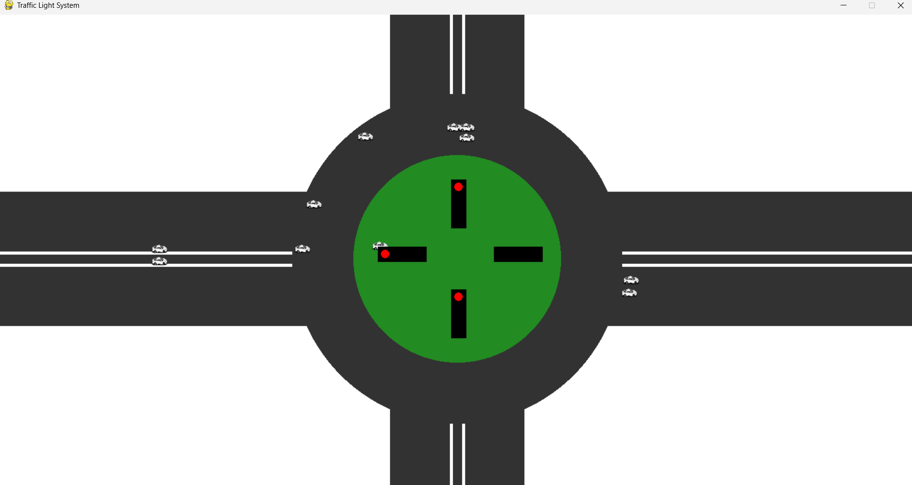

# 🚦 Smart Traffic Light Simulation

A dynamic and realistic simulation of a **4-way Indian intersection** using Python and Pygame! This project demonstrates a traffic light system with roundabout logic, phase cycling, and vehicles that obey signals.

---

## 🧠 Features

- Simulates North, South, East, and West traffic with signals.
- Cars move only when their signal turns green.
- Follows Indian-style traffic light phasing.
- Smooth car movement and circular roundabout logic.
- Visual feedback with Pygame UI.

---

## 🎮 How to Use

1. Move your mouse over a lane.
2. Left-click to add a car.
3. The car will wait until the signal is green.
4. Observe traffic signals rotate in a realistic cycle.

---

## 🚥 Traffic Signal Phases

| Step | Direction | Signal  | Duration |
|------|-----------|---------|----------|
| 1    | North     | GREEN   | 3 sec    |
| 2    | North     | YELLOW  | 1 sec    |
| 3    | West      | GREEN   | 3 sec    |
| 4    | West      | YELLOW  | 1 sec    |
| 5    | South     | GREEN   | 3 sec    |
| 6    | South     | YELLOW  | 1 sec    |
| 7    | East      | GREEN   | 3 sec    |
| 8    | East      | YELLOW  | 1 sec    |
| 9    | North     | GREEN   | 3 sec    |
| 10   | North     | YELLOW  | 1 sec    |


---

## 📸 Preview




---

## 🛠 Installation

```bash
git clone https://github.com/yourusername/traffic-simulation-python.git
cd traffic-simulation-python
pip install pygame
python traffic_simulation.py
